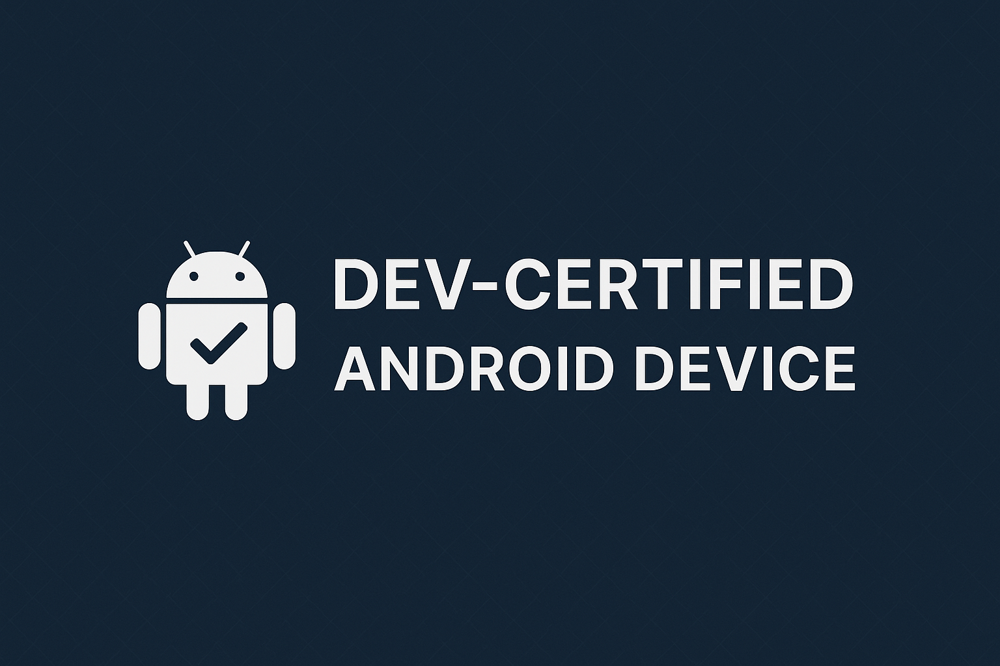

  

# Dev-Certified Android Device Proposal

> **A secure, root-enabled Android device line for ethical developers.**

---

## 📘 Overview

This proposal introduces a new category of Android devices designed specifically for developers, ethical hackers, ROM maintainers, and researchers — known as **Dev-Certified Devices**.

These phones would be officially sanctioned to have root access, unlocked bootloaders, long-term software support, and would operate under a legal waiver system to prevent abuse.

---

## 💡 Key Features

- 🔓 Bootloader unlocked by default  
- 🛠️ Root access officially enabled (no hiding tricks)  
- 📜 Legal waiver signed by the developer  
- 💰 Higher pricing to avoid casual misuse  
- 🔒 Firmware watermarked per developer account  
- 🔐 Verified Boot disabled (with clear warnings)  
- 🛡️ 15 years of kernel and security update support  
- 🧾 Strict license forbidding unauthorized firmware redistribution  

---

## 🧠 Why It Matters

Rooting is not a crime — but irresponsible use hurts the platform. Devs are locked out while bad actors find workarounds.

This initiative allows:
- ✅ Legitimate developers to work freely
- ✅ Google and OEMs to control distribution and responsibility
- ✅ Apps and banks to trust devices again

---

## 🔐 Dev Access Model

To acquire a Dev-Certified Device, you must:
- Submit proof (GitHub profile, ROM repo, student/academic ID, etc.)
- Sign a developer waiver acknowledging risk and responsibility
- Accept firmware bound to your account identity

> See [dev-access-model.md](./dev-access-model.md)

---

## 📂 What's Inside This Repo

- `README.md` – This file  
- `proposal.pdf` – Full printable proposal  
- `dev-access-model.md` – Access control and dev qualifications  
- `benefits.md` – Stakeholder advantages (Google, OEMs, developers)  
- `legal-waiver-draft.md` – Sample developer agreement  
- `LICENSE.md` – Creative Commons Attribution-ShareAlike 4.0 License  

---

## 🙌 How to Support

- ⭐ Star this repo to show support  
- 🍴 Fork and improve it  
- 🐛 Submit issues or suggestions  
- 🔗 Share the idea on Reddit, Twitter, XDA  

> Android deserves a root path that is secure, responsible, and developer-first.

— **ToxC7**

---

🧠 _AI Acknowledgment_: This proposal was structured with the help of ChatGPT by OpenAI for formatting, completeness, and presentation.
